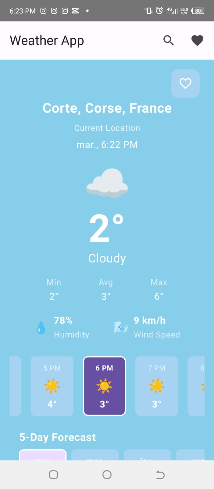
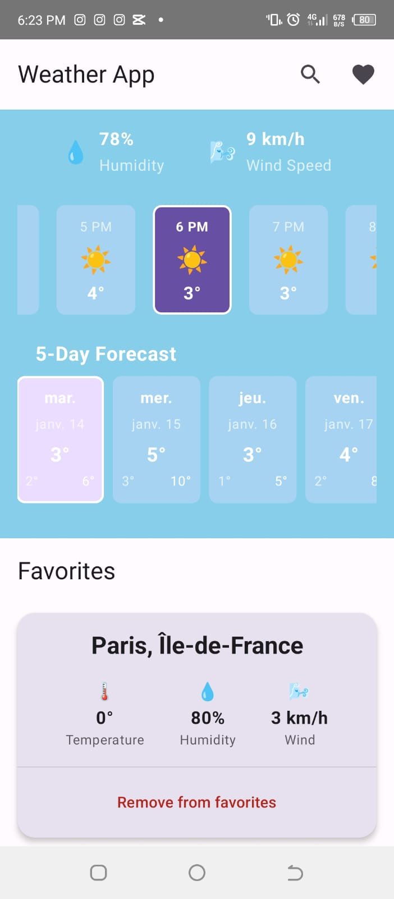
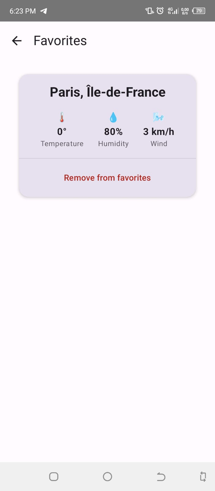

# Weather App

A modern Android weather application that allows users to check weather conditions for different cities and manage their favorite locations.

## Features

- Real-time weather information using OpenMeteo API
- Save and manage favorite cities
- Offline support with local caching
- Clean MVVM Architecture
- Location-based weather detection
- Beautiful Material Design interface
- Smart caching system for offline access
- Smooth animations and transitions

## Tech Stack

- **Kotlin** - Primary programming language
- **Android Architecture Components**
  - Room Database - For local data persistence
  - ViewModel - For managing UI-related data
  - Flow - For reactive data streams
- **Retrofit** - For making API calls
- **Coroutines** - For asynchronous programming
- **Jetpack Compose** - For modern UI development
- **Material Design 3** - For consistent styling

## Project Structure

```
app/
├── data/
│   ├── WeatherDao
│   ├── FavoriteDao
│   └── WeatherDatabase
├── api/
│   ├── RetrofitInstance
│   └── WeatherApi
├── model/
│   ├── CachedWeather
│   └── FavoriteCity
└── ui/
    ├── MainActivity
    └── WeatherViewModel
```

## Setup

1. Clone the repository
2. Open the project in Android Studio
3. Sync Gradle files
4. Run the app on an emulator or physical device

## Building

```bash
# Debug build
./gradlew assembleDebug

# Release build
./gradlew assembleRelease
```

## Dependencies

The project uses several key dependencies:

- AndroidX Core KTX
- Room Database
- Retrofit for network calls
- Kotlin Coroutines
- ViewModel and LiveData
- Jetpack Compose
- Material Design Components

## Screenshots

<p align="center">
<em>Main Weather Screen 1</em>
</p>
<p align="center">
    
</p>

<hr width="50%" style="margin: auto;"/>

<p align="center">
<em>Main Weather Screen 2</em>
</p>
<p align="center">
    
</p>

<hr width="50%" style="margin: auto;"/>

<p align="center">
<em>Favorites</em>
</p>
<p align="center">
    
</p>

## License

This project is licensed under the MIT License - see the LICENSE file for details.
